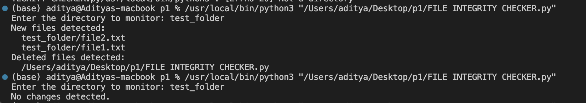
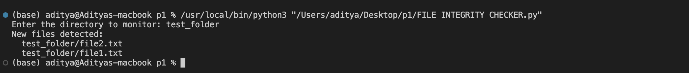

# 🔍 FILE-INTEGRITY-CHECKER

## 🧾 Overview

This Python script monitors a specified directory for file changes by calculating and storing **SHA-256 hashes** of files. It detects:

- 🆕 New files added
- ✏️ Existing files modified
- ❌ Files deleted since the last check

The script stores file hashes in a JSON file (`file_hashes.json`) to track changes between runs.

---

## 🔐 Screenshots

### ✅ Result Output




---

## ✨ Features

- 🔁 **Recursive scanning** of all files in the target directory
- 🔒 Uses **SHA-256 hashing** for reliable file integrity verification
- 📋 Reports **new**, **modified**, and **deleted** files
- 💾 **Persistent tracking** via a JSON hash store

---

## ⚙️ Requirements

- Python **3.x**
- No external libraries required (uses only built-in modules)

---

## 🚀 Usage

1. **Clone or download** this repository:

```bash
python file_integrity_monitor.py
